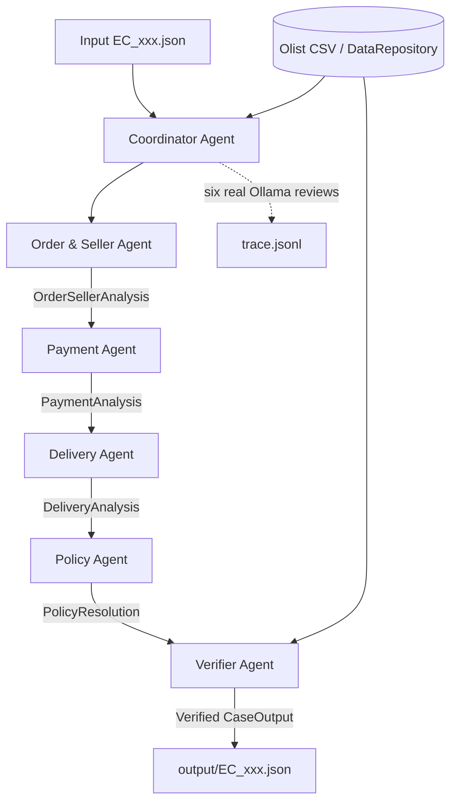

# Kiến trúc Multi-Agent — Olist Dispute Resolution

## 1. Quyết định triển khai

Repo sử dụng duy nhất pipeline module hóa:

```text
python -m src.main --all
        |
        v
src/coordinator.py
        |
        +--> OrderSellerAgent
        +--> PaymentAgent
        +--> DeliveryAgent
        +--> PolicyAgent
        `--> VerifierAgent
```

`main.py` ở root chỉ là compatibility wrapper gọi `src.main`. Pipeline cũ nguyên khối đã được loại bỏ để tránh hai nguồn tạo output khác nhau.

## 2. Model và runtime

Toàn bộ sáu vai trò dùng chung model local:

```text
Model: qwen2.5:0.5b
Parameter size: 0.49B
Provider: Ollama
Runtime: local, http://127.0.0.1:11434
```

Model dưới giới hạn 10B của đề. Mỗi vai trò thực hiện một structured Ollama invocation để kiểm duyệt facts trước khi handoff. LLM không được tự tạo ID, timestamp, payment hoặc refund.

Các phép join, cộng tiền, so sánh timestamp và áp dụng policy được code deterministic thực hiện. Verifier tính lại từ CSV trước khi cho phép ghi output.

## 3. Sơ đồ agent và handoff



## 4. Vai trò và quyền truy cập

| Agent | Module | Dữ liệu được dùng | Output handoff |
|---|---|---|---|
| Coordinator | `src/coordinator.py` | Case input và các row do repository trả về | `CaseContext` |
| Order & Seller | `src/agents/order_seller_agent.py` | Order, items, seller IDs, shipping limits | `OrderSellerAnalysis` |
| Payment | `src/agents/payment_agent.py` | Payment rows và totals từ Order/Seller | `PaymentAnalysis` |
| Delivery | `src/agents/delivery_agent.py` | Delivery timestamps và seller handoff flag | `DeliveryAnalysis` |
| Policy | `src/agents/policy_agent.py` | Kết quả ba domain agent và `EC_POLICY_V1` | `PolicyResolution` |
| Verifier | `src/agents/verifier_agent.py` | Draft output và read-only `DataRepository` | `CaseOutput` hoặc lỗi |

Các contract nằm trong `src/schemas.py`. Shared state là `CaseContext`; mỗi agent chỉ ghi phần kết quả thuộc domain của mình.

## 5. Luồng xử lý

1. `Coordinator` đọc input và truy xuất order/items/payments qua `DataRepository`.
2. Coordinator gọi Ollama cho vai trò điều phối và ghi trace.
3. `OrderSellerAgent` tính item/freight, seller và seller handoff; kết quả được Ollama kiểm duyệt rồi handoff.
4. `PaymentAgent` dùng `Decimal` để tính payment, split payment và sai số 0.10 BRL; kết quả được kiểm duyệt rồi handoff.
5. `DeliveryAgent` so sánh timestamps; kết quả được kiểm duyệt rồi handoff.
6. `PolicyAgent` áp dụng sáu rule theo đúng priority; kết quả được kiểm duyệt rồi handoff.
7. `VerifierAgent` kiểm tra schema, ID, evidence, totals, refund và case status trực tiếp với CSV.
8. Chỉ output đã pass Verifier mới được ghi. Nếu Verifier lỗi, lượt chạy dừng.

## 6. Quy tắc correctness

- Tiền được tính bằng `Decimal` và làm tròn hai chữ số.
- `payment_value` không nhân với installments.
- Seller late khi carrier date lớn hơn shipping limit của item.
- Delivery late khi delivered customer date lớn hơn estimated date.
- Policy dùng chuỗi priority cố định, không để LLM chọn số tiền.
- Verifier báo lỗi; không âm thầm cắt danh sách hoặc sửa output.
- Evidence chỉ chấp nhận năm định dạng trong README và phải tồn tại trong CSV.

## 7. Trace

`TraceWriter` mở `trace.jsonl` ở chế độ ghi đè khi bắt đầu lượt chạy. Mỗi case có đúng sáu dòng theo thứ tự:

```text
CoordinatorAgent
OrderSellerAgent
PaymentAgent
DeliveryAgent
PolicyAgent
VerifierAgent
```

Mỗi dòng ghi model, parameter size, provider, action, trạng thái invocation và tóm tắt ngắn. Trace không lưu secret hoặc chain-of-thought.

## 8. Lệnh chạy và kiểm chứng

```powershell
# Lượt chạy chính thức có Ollama thật
python -m src.main --all

# Chế độ test không gọi Ollama
python -m src.main --all --deterministic

# Kiểm chứng
python -m pytest -q
python scripts\validate_outputs.py
python scripts\validate_trace.py
```

Pipeline không tạo ZIP. Việc nén riêng `output/` được thực hiện thủ công sau khi mọi validation pass.
